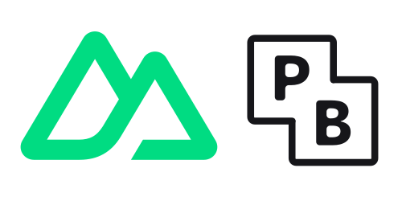

<div align="center">


</div>

## [Quick Demo](https://pocketnuxt.williamson.ninja/auth/login)
This demo allows you to login and see pocketnuxt in action. This is hosted on a small droplet in DigitalOcean using systemctl.


# Pocket Nuxt

Nuxt3 and PocketBase delivered in a simple binary that can run anywhere.

This is achieved by compiling the Nuxt app into a static hosted folder and then using Go to serve the static files and pocketbase api.
```go
//go:embed all:.output/public
var public embed.FS
```
Make it your own by extending [Pocketbase](https://pocketbase.io/docs/) and adding your app to the app folder.


## Stack
- PocketBase
- Nuxt3
- PrimeVue
- PrimeIcons


## Run Locally
This will run both a Nuxt3 dev server with hot reload and a pocketbase instance with a authentication and an api ready to go.


Clone the project

```bash
  git clone https://github.com/j-wil/pocket-nuxt
```

Go to the project directory

```bash
  cd pocket-nuxt
```

Install dependencies

```bash
  yarn install
```

Start the server

```bash
  yarn dev
```

| URL                 | Function                       |
|---------------------|--------------------------------|
| localhost:8090/_/   | pocketbase admin setup and log |
| localhost:8090/api/ | pocketbase api                 |
| localhost:3000/     | nuxt3 dev server               |

From there build your nuxt app as normal. Follow the [pocketbase docs](https://pocketbase.io/docs/) for more info on how to use pocketbase.


## Deployment

This will create a single binary containing Nuxt and PocketBase for deployment.

```bash
  yarn build:prod
```

```bash
  ./pocketnuxt serve --http "yourdomain.com:80" --https "yourdomain.com:443"
```
https://pocketbase.io/docs/going-to-production/ for more examples.

## Acknowledgements

 - [PocketBase](https://github.com/pocketbase/pocketbase)